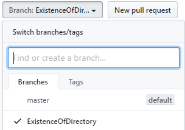

# NonWebSamples

Samples of non web code for general client server based features or issues. It help users to resolve or add new requirement using these non web samples of code.

# Contents
Branch for client server based examples which are open source and licensed under MIT.

# Video and Downloads

Need a Panther Web 552 Redhat Image? [Click Here](https://hub.docker.com/r/prolificspanther/pantherweb "Named link title") 

[Click Here](https://prolifics.com/panther-trial-license-request/ "Named link title") for a 45-day license.

How to set up a Panther Servlet Web Application? [Click Here](https://github.com/ProlificsPanther/PantherWeb/releases "Named link title")

Read our Documentation [here](https://docs.prolifics.com)
